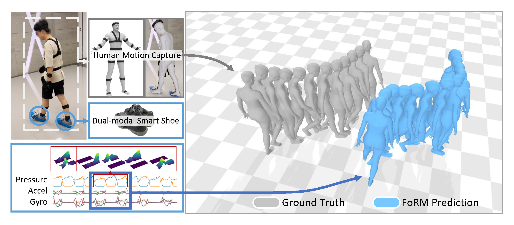

# FoRM: Foot-driven Reconstruction of Human Motion using Dual-Modal Plantar Pressure and Inertial Sensing

This repository contains the official PyTorch implementation of:

> **FoRM: Foot-driven Reconstruction of Human Motion using Dual-Modal Plantar Pressure and Inertial Sensing** 
>
> Qijun Ying, Zehua Cao, Ziyu Wu, Wenwu Deng, Yuchen Zhong, Yukun Diao, Xiaohui Cai*
>
> [Paper]() | [Project Page]()



## Installation

To set up the environment, install the required packages using pip:

```bash
pip install -r requirements.txt
```

In current version, you can directly run the code using the provided assets, checkpoints, and data.

Key dependencies include:

- PyTorch (>=1.10.0) for model training/inference
- SMPL for body model parameterization
- Joblib for data loading utilities

## HAMPI Dataset

The HAMPI dataset consists of synchronized plantar pressure and inertial measurements with corresponding motion capture data. Currently, only the validation split is publicly available for research purposes.

Dataset specifications:

- Contains data from 18 subjects (aged 21-69) performing 18 types of daily activities
- Each sample includes:
  - Dual-modal smart shoes measurement with plantar pressure and dual IMUs per foot (60Hz)
  - SMPL pose parameters (60Hz)
  - Noitom motion capture refined output (60Hz)

Please see LICENSE for usage terms and citation requirements.

> We have prepared the dataset ready. We would release the dataset as soon as the paper is published.

<!-- ## Training -->

## Evaluation

To reproduce paper results:

```
python eval.py
```

Note: Reported metrics may vary slightly (±0.1%) due to:

- Hardware differences in floating-point computation
- Random seed initialization in probabilistic components
- Minor version differences in dependency libraries

## TODO

- [ ] HAMPI Dataset release
- [x] Evaluation scripts release
- [ ] Checkpoints and assests release
- [ ] Training scripts release

## Citation

Please cite the following paper if you use this code directly or indirectly in your research/projects:

```
@article{ying2025form,
  title={FoRM: Foot-driven Reconstruction of Human Motion Using Dual-Modal Plantar Pressure and Inertial Sensing},
  author={Qijun Ying, Zehua Cao, Ziyu Wu, Wenwu Deng, Yuchen Zhong, Yukun Diao, Xiaohui Cai},
  journal={Proceedings of the ACM on Interactive, Mobile, Wearable and Ubiquitous Technologies (IMWUT)},
  year={2025}
}
```

## Acknowledgments
Partial code is adapted from [PIP](https://github.com/Xinyu-Yi/PIP), [WHAM](https://github.com/yohanshin/WHAM), and [GroundLink](https://github.com/hanxingjian/GroundLink).

## License

This repository is released under the MIT License.

## Contact

Please contact yqj@mail.ustc.edu.cn for any questions related to this work.
